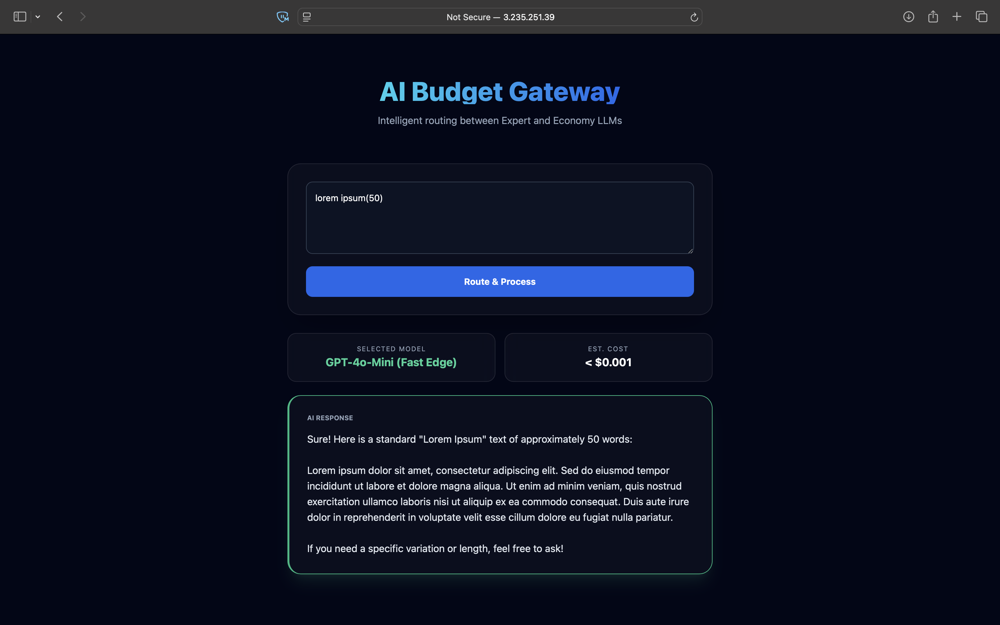

# 🚀 AI Model Router & Smart Budget Gateway

A production-ready Django application that intelligently routes user prompts to different LLM models (GPT-4o vs. GPT-4o-Mini) based on query complexity to optimize API costs by up to 90%.

---

### 🌐 [Live Web Demo](http://3.235.251.39) 
*(Note: Replace the IP above with your actual AWS IP if it changed)*

---

## 💡 The Problem
Companies often overspend on AI by sending every simple request to expensive "expert" models (like GPT-4o). This project demonstrates a **middleware solution** that analyzes prompt intent and selects the most cost-effective model without sacrificing performance.

## ✨ Key Features
- **🧠 Semantic Routing Engine:** Analyzes prompt length and intent (technical vs. casual) to decide between "Expert" and "Economy" tiers.
- **🎨 Modern UI/UX:** A high-end Glassmorphism dashboard built with Tailwind CSS.
- **⚡️ Production Architecture:** Powered by **Gunicorn** and **Nginx** for high-concurrency handling.
- **🐋 Fully Dockerized:** Microservices architecture using Docker Compose for seamless environment parity.
- **🔄 CI/CD Pipeline:** Automated deployment to **AWS EC2** via GitHub Actions on every code push.

## 🛠️ Tech Stack
- **Backend:** Python, Django
- **AI Integration:** OpenAI API (GPT-4o & GPT-4o-mini)
- **Frontend:** Tailwind CSS, JavaScript (Fetch API)
- **Infrastructure:** AWS EC2, Nginx, Gunicorn
- **DevOps:** Docker, Docker Compose, GitHub Actions

## 🏗️ System Architecture
1. **User Request** → **Nginx** (Reverse Proxy)
2. **Nginx** → **Gunicorn** (WSGI Server)
3. **Django App** → **Routing Logic** (Complexity Check)
4. **Logic** → **Selected Model** (OpenAI API)
5. **UI** → Displays Response + Cost Savings Analysis

## 🚀 How to Run Locally
1. Clone the repo: `git clone https://github.com/Altay911/AI-Model-Router.git`
2. Create a `.env` file with your `OPENAI_API_KEY`.
3. Start with Docker: `docker-compose up --build`
4. Visit `localhost:8000`